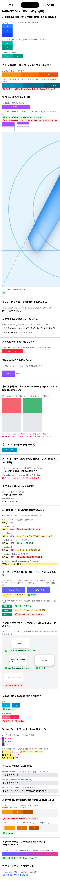
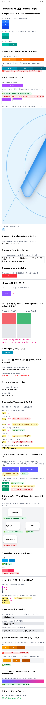

# nativewind-v5-playground

Zenn 記事「**WebエンジニアのためのReact Native + NativeWind v5事始め — Webの常識が通用しない18のポイント**」の検証用ミニマルアプリです。

<!-- TODO: 記事公開後に URL を差し替える -->
記事: https://zenn.dev/articles/2bbf47bb0db842

記事中の「実測」は、このアプリを iOS シミュレータ / Android エミュレータで動かして確認したものです。画面には記事の見出し番号(①〜⑱)と同じ番号のセクションが並び、各比較に ✅/⚠️/❌ の判定チップが付いています。

ビルドせずに中身を確認できるよう、全セクションを縦に繋げたスクリーンショットを載せています。

| iOS(iPhone 17 シミュレータ) | Android(Pixel エミュレータ) |
| --- | --- |
|  |  |

## 環境

- nativewind `5.0.0-preview.2`
- react-native-css `3.0.7`
- tailwindcss `4.2.2`(+ `@tailwindcss/postcss`)
- react-native `0.83`(New Architecture / Fabric)
- react-native-reanimated `4.2` + react-native-worklets `0.7.4`
- Expo SDK 55

## 起動手順

```bash
npm install

# iOS(シミュレータ)
npx expo run:ios

# Android(エミュレータ)
npx expo run:android
```

- `postcss.config.mjs`・`metro.config.js`・`package.json` の `overrides`(lightningcss 固定)は設定済みです。**このどれかを消すと記事の「セットアップ段階の静かに壊れるポイント」を体験できます**
- ダークモード検証(⑮)はシミュレータの外観切り替えで行います
  - iOS: `xcrun simctl ui booted appearance dark`
  - Android: クイック設定などから切り替え

## 記事セクションとの対応表

| 画面 | 検証内容 | 結果(実測) |
| --- | --- | --- |
| ① | `grid` / flex-direction のデフォルト | grid は無視・縦積み(column)がデフォルト |
| ② | `flex-1` / `flexShrink` | flex-1 は兄弟間で等分。flexShrink デフォルト 0 のため固定幅の兄弟は縮まず親をはみ出す |
| ③ | `w-[50%]` / `h-[50%]` / サイズ未指定 Image | w の % は効く。h の % は親の高さ未指定だと不定値に暴発。ローカル画像は**原寸で描画**される |
| ④ | View にテキスト装飾 | 効かない(ダークモードでは黒文字が背景に同化する例にもなる) |
| ⑤ | `overflow-y-auto` でスクロール | しない(ジェスチャは外側の ScrollView に抜ける) |
| ⑥ | `fixed` | 無視され、その場に留まる |
| ⑥b | `max-h-[40px]`(補足) | 任意値の maxHeight は効く |
| ⑥c | 【記事対象外】`inset-0` + maxHeight | RN 0.83 では制約衝突は**再現せず**(y=0, h=100 で正常)。記事から削除した根拠 |
| ⑦ | `w-[100px]` の実測 | 100.0(px = dp) |
| ⑧ | スタイル継承 | View からは継承されない / Text ネストは継承 |
| ⑨ | `font-bold` | システムフォントでは効く |
| ⑩ | `leading-[1.4]` / `leading-5` / `leading-[16.8px]` / style | 任意値は unitless でも px でも無視。`leading-5` はフォントサイズ×1.25 の相対解決。style 直指定は効く |
| ⑪ | iOS 下ズレ / Android 日本語見切れ | iOS はシミュレータでは 0〜1 物理px(実機で顕在化)。Android は自然行高 18.3dp、`py-2` で下半分が消える |
| ⑫ | 影 3 方式 × `overflow-hidden` | ネイティブ影(style)は iOS で消える。`shadow-*`(boxShadow)は効き、o-h と同居しても消えない |
| ⑬ | `gap-3` / `space-x-3` | gap は効く。space-x は無視(密着) |
| ⑭ | rem のベース値 | `w-4` = 14px、`text-base` = fontSize 14(ネイティブは 14px 基準) |
| ⑮ | `dark:` 片側 / 両側指定 | Text のデフォルト色は常に黒(ダークで自動反転しない) |
| ⑯ | `contentContainerClassName` + `contentContainerStyle` | 併用すると className 側の gap / px が落ちる |
| ⑰ | `bg-linear-to-*` | ネイティブでもグラデーションが描画される(RN 側は experimental 扱い) |
| ⑱ | `ios:` / `android:` バリアント | iOS で青・Android で緑に分岐 |

## 備考

- 数値の実測は `onLayout` ベース(`Measured` コンポーネント / ⑥c の `OverlayProbe`)で表示しています
- NativeWind v5 はプレリリースのため、バージョンが変わると結果も変わる可能性があります
